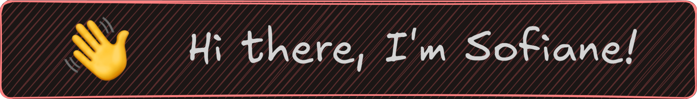

👨‍💻 Fullstack Developer with several years of self-taught learning, specialized in React and Next.js, with a strong interest in UI/UX. I have worked on various projects to enhance my skills, which you can check out on my portfolio.

#### 🌐 [Portfolio](http://portfolio.sofianelasoa.fr)

## Skills

- ReactJS
- NextJS
- ExpressJS 
- Javascript / TypeScript 
- HTML / CSS / SCSS

## Stats

<h4>🤝 Contact me!</h4>

I am looking for an apprenticeship for my third year of a Bachelor's Degree in Computer Science. If my profile interests you, don't hesitate to get in touch 😉.

<!--
**Sail-Cpu/Sail-cpu** is a ✨ _special_ ✨ repository because its `README.md` (this file) appears on your GitHub profile.
